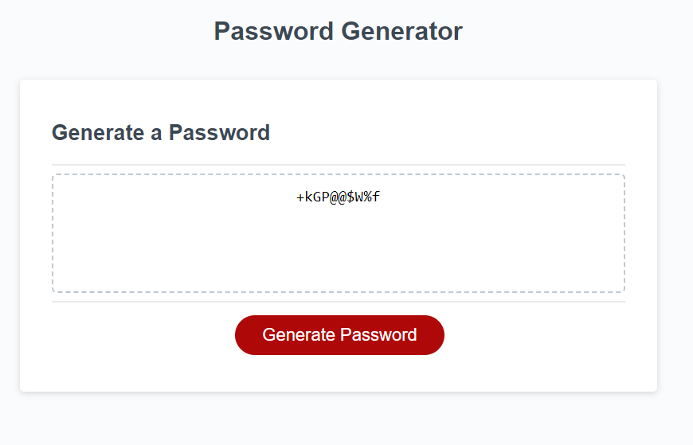

# 03 JavaScript: Password Generator

## Description

This assignment required me to modify existing javascript code to create an application that allows employees to create a random password after inputing a password length between 8-128 characters and indicating which charactersets they want to include in their password.

## Tasks 

- Created a prompt that requests a user input for character length between 8-128
- Created an alert when the password is generated and if the length does not fall within the prompts parameters
- Created conditional statements where user confirms if they want Uppercase, Lowercase, Numbers, and Special Characters.
- A randomizer function that runs a for loop to determine the random characters.

## Usage

## Credits

- https://stackoverflow.com/questions/29719329/convert-array-into-upper-case
- https://developer.mozilla.org/en-US/docs/Web/JavaScript/Reference/Global_Objects/Array/concat
- https://www.youtube.com/watch?v=N4V0FZASK60
- https://www.w3schools.com/jsref/met_win_confirm.asp
- https://www.youtube.com/watch?v=Nz4Cz985FKAgetting-started-with-writing-and-formatting-on-github/basic-writing-and-formatting-syntax#lists
-  https://www.w3resource.com/javascript-exercises/javascript-array-exercise-35.php

## Links

-   https://github.com/rambriz91/Pandoras-box
-   https://rambriz91.github.io/Pandoras-box/

## License

MIT License

Copyright (c) [2023] [Robert Ambriz]

Permission is hereby granted, free of charge, to any person obtaining a copy
of this software and associated documentation files (the "Software"), to deal
in the Software without restriction, including without limitation the rights
to use, copy, modify, merge, publish, distribute, sublicense, and/or sell
copies of the Software, and to permit persons to whom the Software is
furnished to do so, subject to the following conditions:

The above copyright notice and this permission notice shall be included in all
copies or substantial portions of the Software.

THE SOFTWARE IS PROVIDED "AS IS", WITHOUT WARRANTY OF ANY KIND, EXPRESS OR
IMPLIED, INCLUDING BUT NOT LIMITED TO THE WARRANTIES OF MERCHANTABILITY,
FITNESS FOR A PARTICULAR PURPOSE AND NONINFRINGEMENT. IN NO EVENT SHALL THE
AUTHORS OR COPYRIGHT HOLDERS BE LIABLE FOR ANY CLAIM, DAMAGES OR OTHER
LIABILITY, WHETHER IN AN ACTION OF CONTRACT, TORT OR OTHERWISE, ARISING FROM,
OUT OF OR IN CONNECTION WITH THE SOFTWARE OR THE USE OR OTHER DEALINGS IN THE
SOFTWARE.